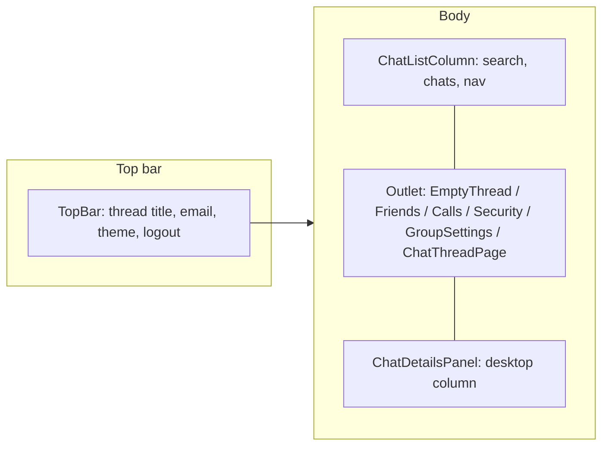

# Backend ↔ frontend integration

This document describes how the **Vite + React** app in `frontend/` talks to the **Express + Socket.IO** API in `backend/` in the current repo.

## 1. Runtime topology

| Piece | Default local URL | Notes |
|--------|-------------------|--------|
| Backend HTTP + Socket.IO | `http://127.0.0.1:4000` (or `HOST`/`PORT` in `backend/.env`) | Single process serves REST under `/api/v1` and Socket.IO on path `/socket.io`. |
| Frontend (Vite dev) | `http://localhost:5173` | Browser origin for the SPA. |
| API base (contract) | **`/api/v1`** | All REST routers are mounted in `backend/src/app.ts` on `app.use("/api/v1", …)`. |

**Local development (recommended):** keep `VITE_API_BASE_URL` unset or set to **`/api/v1`** so the app is same-origin with the Vite dev server. Vite proxies traffic to the backend so the browser can send **httpOnly refresh cookies** without CORS workarounds.

- Proxied paths (see `frontend/vite.config.ts`):
  - **`/api`** → `VITE_PROXY_TARGET` (default `http://127.0.0.1:4000`)
  - **`/socket.io`** → same target, **WebSocket enabled** (`ws: true`)

**Without the proxy:** set `VITE_API_BASE_URL` to the full backend origin, e.g. `http://127.0.0.1:4000/api/v1`, and configure `CORS_ORIGIN` on the backend to allow the frontend origin. You must also set `VITE_SOCKET_URL` to the backend origin so Socket.IO does not try to connect to the Vite port.

## 2. Environment variables

### Frontend (`frontend/.env` - copy from `frontend/.env.example`)

| Variable | Role |
|----------|------|
| `VITE_API_BASE_URL` | REST prefix. Default **relative** `/api/v1` (works with the proxy). |
| `VITE_SOCKET_URL` | Socket.IO server origin. If unset in the browser, defaults to **`window.location.origin`** (correct when using the proxy). |
| `VITE_PROXY_TARGET` | Backend URL for Vite **dev + preview** proxy only (must match backend `PORT`). |
| `VITE_TURN_URL` (+ username/credential if needed) | Optional TURN for WebRTC; STUN comes from app ICE config. |

Typed accessors: `frontend/src/config/env.ts` (`getEnv()`).

### Backend (`backend/.env` - see `backend/.env.example`)

Important for integration:

| Variable | Role |
|----------|------|
| `PORT`, `HOST` | Must align with `VITE_PROXY_TARGET` / `VITE_SOCKET_URL` in dev. |
| `CORS_ORIGIN` | Allowed browser origin(s) when frontend and API are on different hosts. |
| `JWT_ACCESS_SECRET`, `JWT_REFRESH_SECRET` | Access JWT + refresh session signing. |
| `REFRESH_COOKIE_NAME` | httpOnly cookie used with `/api/v1/auth/refresh`. |
| `FRONTEND_URL` | Used for password-reset links (email flows). |

## 3. Authentication

**Model:** short-lived **access JWT** (stored in Redux `session.accessToken`) + **refresh token** in an **httpOnly cookie** (not readable from JS).

**REST:**

- `fetchBaseQuery` uses **`credentials: 'include'`** so cookies are sent (`frontend/src/shared/api/baseQuery.ts`).
- **`Authorization: Bearer <accessToken>`** is attached when a token exists.
- On **401**, **`baseQueryWithReauth`** serializes refresh attempts (mutex), POSTs **`/auth/refresh`**, then retries the original request. Paths that must **not** trigger refresh (wrong password, etc.) are listed in `frontend/src/shared/api/authPaths.ts` (`/auth/login`, `/auth/register`, `/auth/refresh`, …).

**Socket.IO:**

- After login, `SocketProvider` connects with **`auth: { token: accessToken }`** (`frontend/src/shared/socket/socketClient.ts`). The backend validates the JWT on connection (see backend README / socket middleware).

## 4. REST API usage from the frontend

### 4.1 RTK Query (`apiSlice` + E2EE injection)

Primary client: **`frontend/src/shared/api/apiSlice.ts`** - base URL from `getEnv().apiBaseUrl`, endpoints are **paths under `/api/v1`** (the slice omits the `/api/v1` prefix because it is part of `baseUrl`).

**Implemented endpoints (representative):**

| Area | Paths (relative to `apiBaseUrl`) |
|------|-----------------------------------|
| Health | `GET /health` |
| Auth | `POST /auth/login`, `/auth/register`, `/auth/refresh`, `/auth/logout`, `/auth/logout-all`, `GET /auth/me`, `POST /auth/forgot-password`, `/auth/reset-password` |
| Chats & messages | `GET/POST /chats`, `GET /chats/:id`, `GET/POST /chats/:id/messages`, `PATCH /chats/:id/mute`, `PATCH /chats/:id/e2ee` (E2EE module), `POST /chats/:id/polls` |
| Messages | `PATCH/DELETE /messages/:id`, `POST/DELETE /messages/:id/reactions/...` |
| Friends | `GET /friends`, `POST /friends/request`, `/friends/accept`, `/friends/reject`, `DELETE …` |
| Users | `GET /users/search` |
| Groups | `POST /groups`, `PATCH /groups/:id`, members + role routes |
| Polls | `GET /polls/:id`, `POST /polls/:id/vote` |
| Devices | `POST /devices/web` (Web Push subscription body) |
| Calls | `GET /calls/history` (response shaped as `{ ok, data }`, transformed in the slice) |

**E2EE (actual repo):** `frontend/src/features/e2ee/` — `e2eeApi.ts`, `bootstrap.ts`, `directChat.ts`, `prepareOutbound.ts`. Keys upload on login/register; all DIRECT chats are mandatory `DM_V1` (no client toggle). Recovery UI: Settings → Privacy (`E2eeRecoveryPanel`). Backend: `/e2ee/identity`, `/e2ee/devices/...`, `/e2ee/backup`, recovery email routes; `PATCH /chats/:id/e2ee` cannot downgrade to `NONE`.

### 4.2 Direct `fetch` / XHR (same `apiBaseUrl`)

These bypass RTK Query but use the same base and credentials pattern:

| Usage | Method | Path |
|-------|--------|------|
| Multipart uploads + progress | `POST` | `{apiBaseUrl}/uploads` - `frontend/src/features/attachments/useFileUpload.ts` |
| Download attachment blob | `GET` | `{apiBaseUrl}/files/:key` - `frontend/src/features/attachments/useFileObjectUrl.ts` |
| Public config (VAPID key) | `GET` | `{apiBaseUrl}/config/public` - `frontend/src/features/notifications/pushSubscription.ts` |

## 5. Socket.IO events

**Client setup:** `io(socketUrl, { auth: { token }, transports: ['websocket'] })`.

Event names are centralized in **`frontend/src/shared/socket/socketEvents.ts`** and align with **`backend/src/sockets/handlers.ts`**.

**Client → server (examples):** `chat:subscribe`, `chat:unsubscribe`, `message:send`, `receipt:delivered`, `receipt:read`, `typing:start`, `typing:stop`, `presence:update`, `sync:hello`, and WebRTC **`call:offer`**, **`call:answer`**, **`call:reject`**, **`call:end`**, **`call:ice`**. Many handlers use **ack callbacks** `{ ok, data } | { ok: false, code, message }`.

**Server → client (examples):** `session:ready`, `chat:subscribed`, `chat:error`, `message:new`, `message:updated`, `message:deleted`, `reaction:added`, `reaction:removed`, `receipt:delivered`, `receipt:read`, `typing:update`, `presence:changed`, and call events **`call:incoming`**, **`call:ringing`**, **`call:answered`**, **`call:rejected`**, **`call:ended`**, **`call:ice`**.

**RTK integration:** `registerSocketListeners` updates RTK Query caches for realtime data; `SocketProvider` invalidates tags after long disconnects. Call signaling is bridged via **`registerCallSocketBridge`** (see `frontend/src/features/calls/`).

## 6. WebRTC (calls)

- **Signaling only** goes through Socket.IO (SDP/ICE relayed through the server; not a media server).
- **REST:** call history via `GET /api/v1/calls/history`.
- **ICE:** STUN from shared frontend ICE helpers; optional **TURN** via `VITE_TURN_*` env vars.

## 7. Backend-only or partial surfaces

- **`/api/v1/moderation/*`** exists on the backend router (`backend/src/routes/index.ts`). There is **no** matching RTK usage under `frontend/src` at present.
- **OpenAPI:** `GET /api/v1/openapi.json`; Swagger UI at **`/api/docs`** when enabled (`ENABLE_SWAGGER` / dev). Use this as the authoritative REST catalog beyond what the SPA calls.

## 8. Frontend UI architecture (planned layout ↔ integration)

This section ties **routes**, **visible UI**, and **backend usage** together. Router source: `frontend/src/app/routes.tsx`. Root providers: `frontend/src/app/providers.tsx`.

### 8.1 Provider stack (boot order)

The SPA wraps the router in a fixed order so auth and realtime work everywhere:

1. **Redux `store`** - holds `session` (access token, user), RTK Query cache, chat/outbox/reliability slices, etc.
2. **`ThemeProvider`** - light/dark tokens (`prefers-color-scheme` aware).
3. **`ToastProvider`** - global toasts.
4. **`SessionGate`** - on first paint, tries **`POST /auth/refresh`** then **`GET /auth/me`**; shows “Restoring session…” until `bootstrapped`. Restores access token from httpOnly refresh without forcing login.
5. **`SocketProvider`** - when `accessToken` exists, opens Socket.IO; on disconnect/reconnect updates reliability state and can invalidate RTK tags after long outages.

Children: **`RouterProvider`** → routes below.

**Takeaway:** users returning with a valid refresh cookie reach `/app` without re-entering password; socket attaches as soon as the access token exists.

### 8.2 Route map (path → main UI → integration)

| Path | Screen / layout | Primary backend touchpoints |
|------|-----------------|-----------------------------|
| `/` | **`IndexRedirect`** | Client-side only: sends logged-in users to `/app`, others to `/login`. |
| `/login` | **`LoginPage`** inside **`AuthLayout`** | `POST /auth/login` → stores access token + user in Redux → navigate `/app`. |
| `/register` | **`RegisterPage`** | `POST /auth/register` → session → `/app`. |
| `/forgot-password` | **`ForgotPasswordPage`** | `POST /auth/forgot-password`. |
| `/reset-password` | **`ResetPasswordPage`** | `POST /auth/reset-password` (token from URL/email flow). |
| `/app` | **`RequireAuth`** → **`MainChatLayout`** → **`EmptyThread`** | No thread selected. **`GET /chats`** (sidebar), optional **`GET /auth/me`** if user not hydrated. Socket connected (global). |
| `/app/c/:chatId` | **`ChatThreadPage`** | **`GET /chats/:chatId`**, **`GET /chats/:chatId/messages`** (paginated). **`useChatSubscription`** → socket `chat:subscribe` + realtime message/receipt/typing events. **`Composer`** → `message:send` socket + outbox; **`POST /chats/:id/messages`** / uploads as implemented. |
| `/app/c/:chatId/settings` | **`GroupSettingsPage`** | Group patch, members, roles: **`PATCH /groups/...`**, **`POST/DELETE /groups/.../members`**, etc. |
| `/app/friends` | **`FriendsPage`** (tabs via **`?tab=`**) | **`GET /friends`**, **`POST /friends/request`**, **`/friends/accept`**, **`/friends/reject`**, **`DELETE …`**, **`GET /users/search`**, **`POST /chats`** (create/get DM - after **accept** or **open DM** on an accepted friend, navigates to **`/app/c/:chatId`**). |
| `/app/calls` | **`CallHistoryPage`** (lazy) | **`GET /calls/history`**. |
| `/app/settings/security` | **`SecuritySettingsPage`** (lazy) | **`e2eeApi`**: identity, devices, backup, recovery email, **`PATCH /chats/:id/e2ee`**. |
| `/app/*` (unknown) | **`NotFoundPage`** | - |

**Auth guard:** **`RequireAuth`** reads `session.accessToken`; if missing, **`Navigate`** to `/login` with `location` state for a possible “return to” pattern.

### 8.3 Main chat shell (three-column “planned” layout)

**Component:** `frontend/src/layouts/MainChatLayout.tsx`.

- **Top bar** - Title reflects **`useGetChatQuery(chatId)`** when a thread is open (`threadTitleFromChatDetail`). Actions: theme toggle, **Log out** (`POST /auth/logout`), **Log out everywhere** (`POST /auth/logout-all`). In dev, socket status is shown for debugging.
- **Left column (`ChatListColumn`)** - **`GET /chats`** with cursor “load more”; local search filters the list. Links to **`/app/calls`** and **`/app/friends`** (badge uses **`GET /friends?status=incoming`**). **Create group** opens dialog → **`POST /groups`**. **`NotificationPermissionCard`** + push registration path uses **`GET …/config/public`** and **`POST /devices/web`**.
- **Center (`Outlet`)** - Route outlet for the table above; thread UI is **`ChatThreadPage`** when `chatId` is present.
- **Right column** - On **viewport ≥ 1200px**, **`ChatDetailsPanel`** is a fixed aside. On smaller screens, details open in a **`Sheet`** when the user opens “details” from the thread (same panel component, `variant` switches).

**Global overlays in this layout**

- **`ConnectivityBanner`** / **`ConnectivityStalledToast`** - offline / socket stall UX (`useOnlineStatus` + socket status).
- **`EncryptionSetupCard`** - prompts E2EE setup when relevant (security feature entry).
- **`ServiceWorkerPushBridge`** - connects SW to app for push if enabled.
- **`CallShell`** + **`CallPeerResolver`** - WebRTC UI (incoming modal, overlay, dock) + signaling glue to Socket.IO call events.

### 8.4 Thread experience (`/app/c/:chatId`)

**`ChatThreadPage`** composes the conversational UI:

- **Header** - Chat title, **`PresenceDot`** (Redux `presenceSlice` fed by socket `presence:changed`), **`TypingIndicator`** (`typing:update`), privacy/E2EE **`PrivacyBadge`**, **Call** actions via **`useCallController`** (socket `call:*`).
- **`MessageList`** - Virtualized list; merges REST-loaded history with socket-driven updates from **`registerSocketListeners`** (new/updated/deleted messages, reactions, receipts).
- **`Composer`** - Draft text, attachments (**`POST {apiBaseUrl}/uploads`** with progress), voice note hook, reply/edit flows, **`typing:start` / `typing:stop`**. Sends via **`message:send`** with client ids; **`outboxSlice`** queues offline/retry behavior when disconnected.
- **`useChatSubscription`** - Ensures the socket room subscription for the active chat (`chat:subscribe` / unsubscribe on leave).

Opening a thread also sets **`reliability.activeChatId`** and clears unread for that chat in the RTK **`listChats`** cache locally so the sidebar badge stays coherent.

### 8.5 Friends & social graph (`/app/friends`)

Tabbed UI (**accepted / incoming / outgoing**) driven by **`?tab=`**. Uses friend list queries and mutations from **`apiSlice`**; search uses **`useLazySearchUsersQuery`**. Accepting a request can **`POST /chats`** to jump into a DM (`navigate` to `/app/c/...`) depending on handler wiring in **`FriendsPage`**.

### 8.6 Group settings (`/app/c/:chatId/settings`)

**`GroupSettingsPage`** - group metadata, membership, roles; maps to **`/groups/*`** REST (see **`apiSlice`** group mutations). Only meaningful for group chats (DMs may redirect or show simplified UI depending on implementation).

### 8.7 Security & E2EE (`/app/settings/security`)

**`SecuritySettingsPage`** (lazy) - device identity, backup, recovery email challenge/verify, per-chat E2EE mode. Uses **`e2eeApi`** injected endpoints and **`patchChatE2ee`**; crypto material is handled client-side; server stores public keys / wrapped backup as per backend module.

### 8.8 Calls UI (`CallShell` + `/app/calls`)

- **Realtime:** **`registerCallSocketBridge`** listens for **`call:incoming`**, **`call:answered`**, **`call:ended`**, ICE, etc.; **`useCallController`** coordinates offer/answer/reject/end with **`mediaStore`** (streams / `RTCPeerConnection` - not in Redux).
- **History list:** **`CallHistoryPage`** → **`GET /calls/history`**.
- **ICE:** Browser uses STUN (+ optional TURN from **`VITE_TURN_*`**).

### 8.9 Observability & polish

- **Tab title / unread:** **`useTabTitleBadge`** (reliability + unread counts).
- **Long disconnect:** After reconnect, **`SocketProvider`** may **`invalidateTags`** for **`Chats`** / **`Messages`** if the disconnect lasted long enough to risk stale data.

### 8.10 Source index (frontend)

| Concern | Location |
|---------|----------|
| Routes | `frontend/src/app/routes.tsx` |
| Auth pages | `frontend/src/features/auth/*` |
| Chat shell & thread | `frontend/src/layouts/MainChatLayout.tsx`, `frontend/src/features/chats/*` |
| API definitions | `frontend/src/shared/api/apiSlice.ts`, `frontend/src/features/security/e2eeApi.ts`, `frontend/src/shared/api/baseQuery.ts` |
| Socket registry | `frontend/src/shared/socket/registerSocketListeners.ts`, `socketEvents.ts` |
| Calls | `frontend/src/features/calls/*` |

For a shorter feature checklist, see **`frontend/README.md`**.

## 9. Quick start checklist

1. PostgreSQL + `backend/.env` → `npm install`, `npm run db:migrate:dev`, `npm run dev` in `backend/` (listen on `4000` or update proxy env).
2. `frontend/` → `npm install`, `npm run dev`; open the URL Vite prints (typically port **5173**).
3. Ensure **`VITE_PROXY_TARGET`** matches the backend origin if not using default `127.0.0.1:4000`.

Additional references: **`frontend/README.md`**, **`backend/README.md`**.
